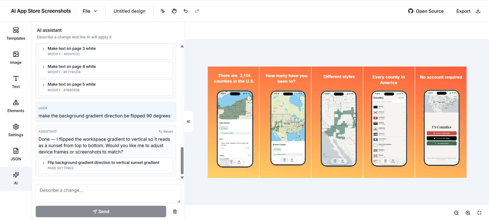

# AI App Store Screenshots

A canvas-based editor for designing App Store / Play Store screenshots with AI assistance. **[Live Demo](https://ai-app-store-screenshots.vercel.app/)**



## Tech Stack

- **Frontend:** Next.js 14, React 18, TypeScript, TailwindCSS, Shadcn UI, Fabric.js
- **State:** Zustand, TanStack Query
- **AI:** OpenAI
- **Uploads:** UploadThing

## Setup

```bash
cp .env.example .env
npm install
npm run dev
```

Fill in `.env`:

- `UPLOADTHING_TOKEN` — create an app at [uploadthing.com](https://uploadthing.com) (free tier: 2 GB).
- `OPENAI_API_KEY` — required for the AI features.

## Contributing

PRs welcome — especially new templates. See [CONTRIBUTING.md](CONTRIBUTING.md).


## License

GNU Affero General Public License v3.0 (AGPL) - see [LICENSE.md](LICENSE.md)
